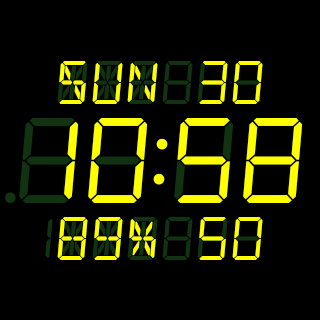
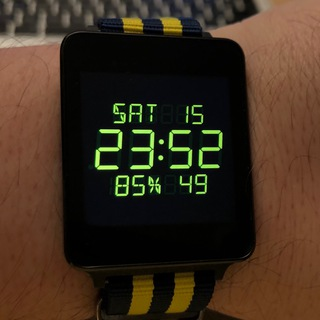

# LEDWatch

It's an LED watch face.

It uses the [DSEG fonts](https://www.keshikan.net/fonts-e.html).

It's in early stages right now.

There's no configuration activity yet.

There's no Android app yet.

It's not yet on the Google Play Store.  Don't ask me when.

## Notes

### Functional Preferences

-   12/24 hour
-   blinking colons?
-   show battery level?
-   show day of week?
-   show day of month?
-   show seconds?

### Cosmetic Preferences

-   Color
    -   greenscreen `#57ff57`
    -   amber       `#eacf4c`
    -   red         `#ff0000`
    -   white       `#ffffff`
    -   yellow      `#ffff00`
    -   blue        `#00ccff`
-   Font preferences (24 total possibilities):
    -   italic/upright
    -   light/regular/bold
    -   classic/modern
    -   regular/mini
-   spacing between chars., like 1970s led watches
-   old school mode:
    -   red
    -   italic light classic non-mini
    -   spacing between characters
-   artificial glow
